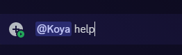

# 🤖 Utilizando a Koya

## Idioma

Como bien sabemos, no nacimos en Gringolandia, y lastimosamente, la página de Koya y los nombres de sus comandos están en inglés. Así que aprenderemos a cómo configurar a Koya en el idioma Español, de esta manera será más fácil usarlo.

### Cómo configurarlo

Hay múltiples maneras de poder configurar el idioma de Koya en tu servidor. Hoy veremos la más sencilla y práctica:

* Asegúrate de tener los permisos suficientes en el servidor para configurar el idioma de Koya. En este caso, necesitas los permisos de Gestionar Servidor
* Ve a un canal de tu preferencia en tu servidor y pon «`/`». Se desplegará un menú de Discord, de esta manera:

<figure><figcaption>
¡Cuántos bots! Creo que deberías utilizar solo a Koya, tiene lo suficiente y… lo necesario.
</figcaption></figure>

* Ahora que nos salió el menú de Discord, en la lista busca a Koya y da clic. Se mostrará la lista de todos los comandos de Koya.


Sé que tal vez no entiendas nada, los nombres y descripciones de cada comando están en inglés. Pero este es el objetivo de esta documentación, ¿no?


<figure><figcaption>
La lista de mis compras está más larga que la de comandos, no te preocupes.
</figcaption></figure>

* Ahora, puedes buscar en la lista el comando «`language`» y seleccionarlo. O también, puedes escribir «`/language`» directamente en el chat y seleccionar el comando de Koya

<figure><figcaption>
 Justo este, recuerda que Koya siempre llevará una foto de Luffy.
</figcaption></figure>

* Una vez lo selecciones, se desplegará un menú con cuatro opciones diferentes en lista, así:

<figure><figcaption>
Es más que obvio cuál elegiremos, ¿no?
</figcaption></figure>

* Ahora, seleccionamos **«Español»**, ¿o hablas francés? ¿Mon amour?

<figure><figcaption>
¿Sabías que el Español es uno de los idiomas más difíciles del mundo? Bueno, no soy TuCosmopolis
</figcaption></figure>

* Por último damos **Enter** o, si estás en móvil, al botón de **«Enviar mensaje»**
* Koya enviará un mensaje, ¡en español!

<figure><figcaption>
Oh, sí, viva, Juan Luis Guerra
</figcaption></figure>

* Eso sería todo. Ahora, cada vez que uses un comando, Koya responderá en Español.


El sitio web y los nombres de los comandos, además de sus descripciones en los comandos de barra diagonal (`/`), se mantendrán en inglés.


## Comandos

Vamos avanzando poco a poco, ahora que tenemos a Koya en Español, será aún más fácil este proceso. Hay dos maneras diferentes para poder usar a Koya:

### Comandos de barra diagonal (slash commands)

Los comandos de barra diagonal (`/`) o también llamados «Slash commands». Los empleamos anteriormente para configurar el idioma de Koya en Español. Solo debes poner «`/`» en el chat, y buscar a Koya en la lista de comandos. Posterior a esto, seleccionas el comando deseado, y lo **«envías».** Puedes aprender más sobre ellos en este [**blog de Discord**](https://discord.com/blog/welcome-to-the-new-era-of-discord-apps)**.**

<figure><figcaption></figcaption></figure>

Esto es el método más fácil y el más nuevo en Discord. El problema es que todas las descripciones de los comandos, **están en inglés**, así como en la página web y ¡qué aburrido! El Chavo no hablaba inglés. ¿Y por qué es más fácil? Porque tienes todas las opciones a un solo clic, a diferencia de los comandos de texto que debes usar _**argumentos**_

### Comandos de prefijo o texto

Los comandos de prefijo o texto, son los clásicos y los más usados.

#### Prefijo o Prefix (en inglés)

¿Por qué se le dice prefijo? Bueno, como lo dice la RAE, **«que va antepuesto principalmente a la raíz»**. Por ejemplo: _des-_ en _desconfiar_, _re-_ en _reponer_.

Pero, en los bots, en este caso Koya, **la “raíz” es el nombre o alias del comando** y lo que va **“antepuesto” es el prefijo o prefix**. Ahora hablemos de los prefijos de Koya:


* Cuando invitas a Koya a tu servidor, el prefijo predeterminado es `^^`. Este puede ser personalizado (puedes cambiarlo por otro), más adelante aprenderemos cómo.
* Los prefijos **globales** de Koya son `koya` (como su nombre) y `@Koya#1050` (mención a @Koya). Estos son globales, lo que significa que son permanentes y no pueden ser cambiados. Sin embargo, puedes seguir utilizando los tres, sin ningún tipo de problema: `^^`, `koya` o `@Koya#1050`


Por lo cual, teniendo en cuenta esto, podemos usar cualquiera de  las tres opciones y funcionará de igual manera. Así:

<figure><figcaption>
@Koya#1050
</figcaption></figure>

<figure><figcaption>
koya help
</figcaption></figure>

<figure><figcaption>
^^help
</figcaption></figure>


No importa si dejas un espacio de un recuadro entre el prefijo y el comando, en los siguientes prefijos:

1. `koya help` o `koyahelp` [✅](https://emojipedia.org/check-mark-button)
2. `@Koya1050 help` o `@Koya1050help` [✅](https://emojipedia.org/check-mark-button)

Respecto al prefix `^^` no puedes dejar espacios o no funcionará, de esta manera:

1. `^^help` [✅](https://emojipedia.org/check-mark-button)
2. `^^ help` [❌](https://emojipedia.org/cross-mark)


### Usando comandos

Muy bien, ahora que hablamos sobre cómo funciona Koya y sus prefijos, podemos empezar a explorar sus comandos. ¿Qué te parece?

Como lo mencioné anteriormente, **los nombres de los comandos se mantienen en inglés** y **las descripciones de los comandos de barra diagonal también**. Por lo tanto, si quieres saber a detalle sobre un comando en Español, utilizaremos los [**comandos de prefijo**](utilizando-a-koya.md#comandos-de-prefijo-o-texto)**.**

#### Comando de ayuda (`help` en inglés)

Empezaremos utilizando el comando que dimos como ejemplo anteriormente. Yo, usaré el prefijo `koya`, ya que es el más fácil para mí:

<figure><figcaption>
El <strong>«Clic Aquí»</strong> te lleva a la <a href="https://koya.gg/commands">página de comandos</a>, que está en inglés. Usemos el menú mejor.
</figcaption></figure>

Vemos que se envía un _embed_, junto con un menú desplegable (**«Menú Principal»**). Da clic sobre él y se desplegará un menú con las diferentes categorías con las que cuenta Koya (**8 en total**):

<figure><figcaption>
¡Todo en inglés! 😊
</figcaption></figure>


«Administration»: Administración (comandos administrativos)

«Adventure»: Aventura (comandos de la aventura de One Piece de Koya)

«Fun»: Diversión (comandos divertidos)

«Image»: Imagen (manipulación de imágenes)

«Info»: Información (comandos informativos)

«Moderation»: Moderación (comandos de moderación)

«Social»: Social (comandos para interactuar con los demás usuarios)

«Utility»: Utilidad (comandos de utilidad)


Puedes seleccionar cualquiera de estas categorías en el menú. Al hacerlo, el _embed_ se editará y mostrará todos los comandos de dicha categoría con su descripción. Por ejemplo, yo escogí la categoría **«Info»**

<figure><figcaption>
Algo larga, ¿no? 😈
</figcaption></figure>

Además de la lista de comandos, vemos que ahora sale otro menú que dice **«Haz una selección»**, ¿la harás? Ji, ji, ji, es broma. Ahora te explicaré qué hace dicho menú, básicamente cuando das clic, se despliega la lista de los comandos que hay en dicha categoría, en este caso **«Info»:**

<figure><figcaption>
Sí, sí, justo así.
</figcaption></figure>

Te preguntarás por qué salen dos menús que dicen lo mismo, básicamente es porque en cada menú solo puede haber **25 opciones** diferentes. Y si vemos cuántos comandos hay en la categoría **«Info»**, vemos que hay **26 comandos**, ups. Es por eso que en el segundo menú encontraremos el único comando que sobra de los 26 comandos, porque solo caben 25 en el primer menú, ¿lo entiendes? Creo que sí

<figure><figcaption>
Ya sé, mis números parecen de niño del kínder…
</figcaption></figure>

Ahora, ¿qué pasa si seleccionamos un comando de(l)(os) menú(s)?
